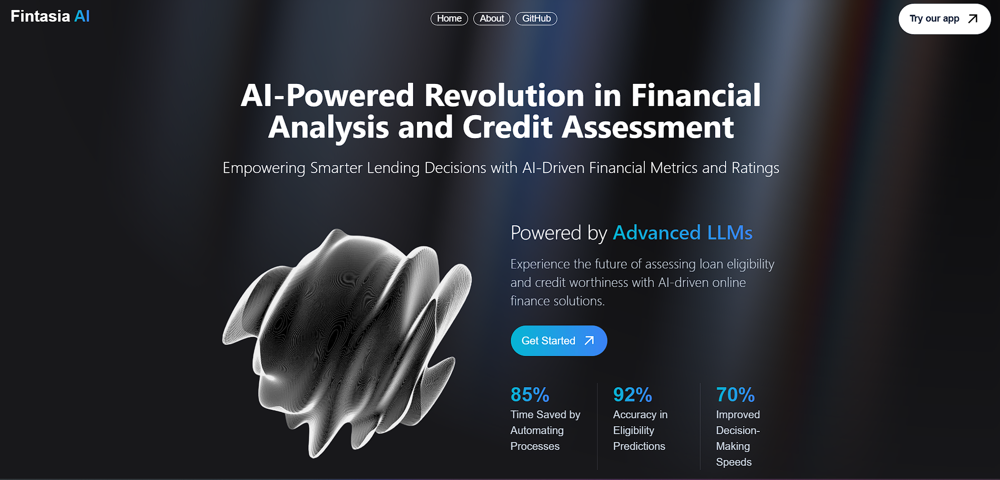

# Fintasia AI

A modern web application designed to provide users with advanced financial
insights, interactive analytics, and detailed reporting, empowering them to make
smarter financial decisions.

## Features

- **Financial Analytics**: Gain insights into account balances, transaction
  patterns, and key financial ratios.
- **Interactive Dashboard**: Explore trends, spending habits, and risk
  indicators in an intuitive interface.
- **Custom Reports**: Generate personalized financial reports with detailed
  explanations and actionable recommendations.
- **User-Centric Design**: Optimized for usability, with a clean and
  professional UI.

## Technologies

- **Frontend**: React, Next.js
- **Backend**: Supabase (database and authentication)
- **Styling**: Tailwind CSS
- **Hosting**: Vercel

## Visit the Application

Access the hosted website here:
[Financial AI Dashboard](https://fintasia-ai.vercel.app/)

## Usage

1. **Login/Sign-Up**: Securely authenticate with your account to access
   personalized features.
2. **Explore Insights**: Navigate through your financial dashboard to review
   analytics and insights.
3. **Generate Reports**: Create and download detailed financial reports tailored
   to your data.
4. **Manage Data**: Easily upload and manage your financial data to keep
   insights up-to-date.

## Feedback

If you have any feedback or suggestions, feel free to reach out or create an
issue on the
[GitHub repository](https://github.com/faizaanqureshi/Fintasia-AI).
